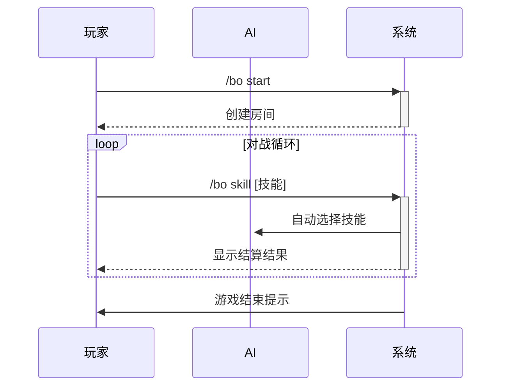

# bo_game 插件 - 波波集对战游戏

## 📌 介绍
这是我们童年玩的波波集游戏bo_game,你将与传说中的最强ai小学生对战
玩法: 按照指令输入实现[集/小波/中波/防]出招，与ai对战。

## 🚀 安装说明
```bash
将插件文件夹放入 AstrBot/data/plugins/ 目录即可
```

## 🎮 游戏指令
| 指令 | 参数 | 说明 |
|------|------|------|
| /bo start | 无 | 创建新对战房间 |
| /bo skill | [集/小波/中波/防] | 使用对应技能 |
| /bo info | 无 | 查看当前状态 |
| /bo end | 无 | 强制结束游戏 |
| /bo help | 无 | 查看帮助文档 |

## ⚔️ 游戏规则


## 🔧 技能说明
| 技能 | 类型 | 攻击力 | 防御力 | 能量消耗 |
|------|------|-------|-------|---------|
| 集   | 能量 | 0     | 0     | -1      |
| 小波 | 攻击 | 1     | 0     | 1       |
| 中波 | 攻击 | 2     | 0     | 2       |
| 防   | 防御 | 0     | 1     | 0       |


- **AI逻辑**: 基于权重随机选择策略


## ❓ 常见问题
**Q: 能量不足会怎样？**  
A: 能量不足时使用技能会导致立即判负


# 波波集游戏插件

一个基于AstrBot框架的回合制对战游戏插件，玩家可以与AI角色"书记仁仁菜"进行策略对战。

## 功能特性

- 🎮 回合制策略对战游戏
- 🤖 智能AI对手（书记仁仁菜）
- ⚔️ 6种不同技能组合
- 🔄 实时状态查看
- 📊 完整游戏记录

## 技能说明

| 技能   | 消耗能量        | 效果             | 特殊限制           |
| ------ | --------------- | ---------------- | ------------------ |
| **集** | -1（获得1能量） | 增加1点能量      | 无限制             |
| **枪** | 1               | 造成1点攻击伤害  | 无限制             |
| **波** | 2               | 造成2点攻击伤害  | 无限制             |
| **防** | 0               | 获得1点防御      | 无限制             |
| **刀** | 0               | 造成1点攻击伤害  | 每局只能使用1次    |
| **弹** | 2               | 反弹对手攻击伤害 | 仅当对手攻击时生效 |

## 游戏规则

1. **初始状态**： 玩家：3点血量，1点能量 AI（书记仁仁菜）：5点血量，1点能量
2. **战斗机制**： 能量系统：使用技能需要消耗能量 防御抵消：防御可抵消等量攻击伤害 攻击对冲：双方同时攻击时会相互抵消 反弹机制：弹技能可反弹对手攻击
3. **胜负条件**： 任意一方血量归零则游戏结束 能量不足使用技能时直接判负

## 安装方法

1. 确保已安装AstrBot框架
2. 将插件文件放入插件目录
3. 重启AstrBot或重新加载插件

## 使用指令

### 基础指令

| 指令              | 说明         | 示例          |
| ----------------- | ------------ | ------------- |
| `/波 开始`        | 开始新游戏   | `/波 开始`    |
| `/波 波波 [技能]` | 使用指定技能 | `/波 波波 枪` |
| `/波 info`        | 查看当前状态 | `/波 info`    |
| `/波 end`         | 结束当前游戏 | `/波 end`     |
| `/波 help`        | 查看帮助信息 | `/波 help`    |

### 技能使用示例

```
/波 波波 集    # 使用"集"技能积累能量
/波 波波 枪    # 使用"枪"技能攻击
/波 波波 防    # 使用"防"技能防御
/波 波波 刀    # 使用"刀"技能（每局限1次）
```

## 游戏流程

1. 使用`/波 开始`开始游戏
2. 每回合使用`/波 波波 [技能]`选择行动
3. AI会自动选择行动
4. 系统结算双方行动结果
5. 查看状态调整策略
6. 直到一方战败游戏结束

## 策略技巧

1. **能量管理**：合理使用"集"技能积累能量
2. **攻防平衡**：不要一味攻击，适时防御
3. **刀技能时机**：珍惜每局限1次的刀技能
4. **反弹反制**：预测对手攻击时使用弹技能
5. **能量预判**：确保有足够能量使用选定技能

## 版本历史

### v1.2.0

- 新增"弹"技能：反弹对手攻击伤害
- 优化AI决策逻辑
- 完善技能说明文档

### v1.1.0

- 增加刀技能使用限制
- 优化游戏平衡性
- 修复已知问题

### v1.0.0

- 初始版本发布
- 基础对战功能
- 5种技能系统

## 注意事项

1. 游戏只能在群聊中进行
2. 每个群同时只能进行一场游戏
3. 游戏数据仅在内存中保存，重启后清空
4. 确保在指令后正确输入技能名称

## 开发者信息

- 插件名称：波波集游戏
- 作者：anchor，桃香修改
- 版本：1.2.0
- 兼容性：AstrBot框架

## 常见问题

**Q：为什么无法使用技能？**

A：请检查：1) 是否已经开始游戏 2) 能量是否足够 3) 技能名称是否正确

**Q：刀技能为什么只能用一次？**

A：这是游戏平衡性设计，刀技能消耗0能量但每局限用1次

**Q：如何查看当前状态？**

A：使用`/波 info`指令查看双方血量和能量

**Q：游戏可以中途退出吗？**

A：可以，使用`/波 end`指令随时结束游戏

------

祝您游戏愉快！如有问题或建议，欢迎反馈。
